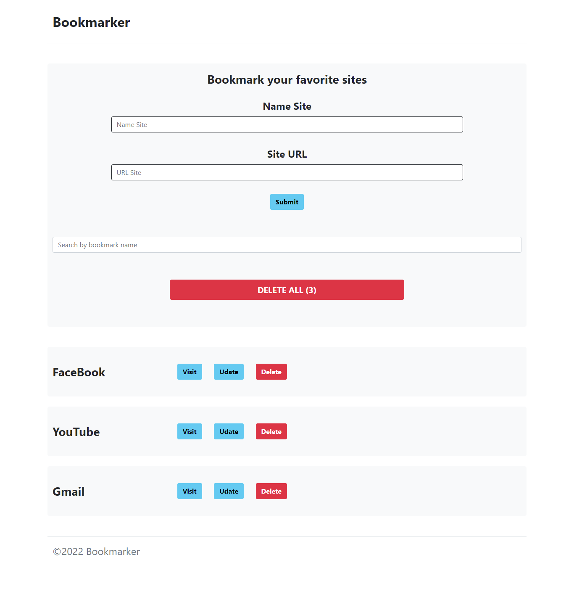

# Building-A-Bookmarker-Application
Building A Bookmarker Application

<h4>Features Of Project 👇<h4>

<ol>
<li>add new item include the name and web sitel</li>
<li>you can visit your bookmark</li>
<li>you can edit your bookmark </li>
<li>you can update your bookmark </li>
<li>you can serch about your bookmark </li>
<li> your bookmarks saved in localStorage </li>

</ol>

